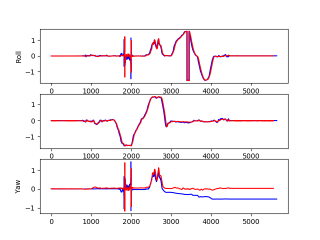

# UKF to Estimate Erientation
This repository contains the implementation of UKF to estimate orientation using just IMU data.

## Results

The drift in the yaw angle cannot be rectified because yaw angle is not observable using just IMU measurements.
